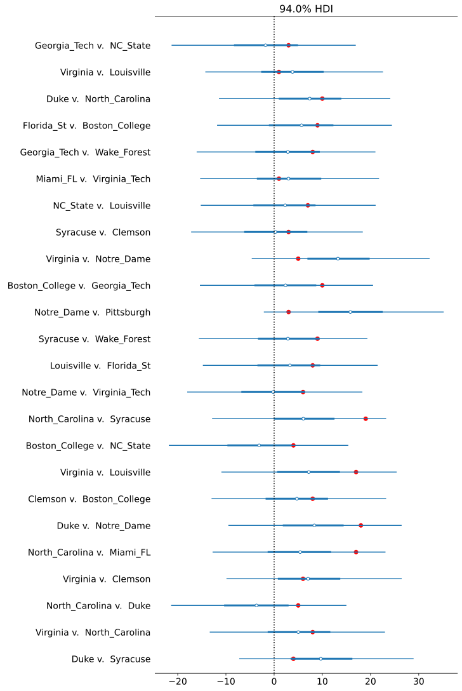

# Bayesian College Basketball Efficiency system

This is demo of a Bayesian efficiency system using Stan. It was tested using ACC basketball games from 2017-2018. The benefit of a Bayesian efficiency system is that it not only makes predictions for a final score, but includes uncertainty as well.

## Data Cleaning

The Python scripts in the `src/python` directory show how I scraped game scores from Basketball Reference and cleaned the data.

## Bayesian Modeling

Stan was used to jointly simulate team strength across the entire season excluding March based on game results alone. Then March was used as a test set.

The figure below shows the credible intervals (blue) and the actual scoring margin (red) for game results played during March 2018.

## Next Steps

This is far from performant enough to be used for real. It doesn't take into account which games were most recent, and it's quite slow even with this subset of data. But it shows the benefits a fully Bayesian system could offer, if it was constructed in the right way.
